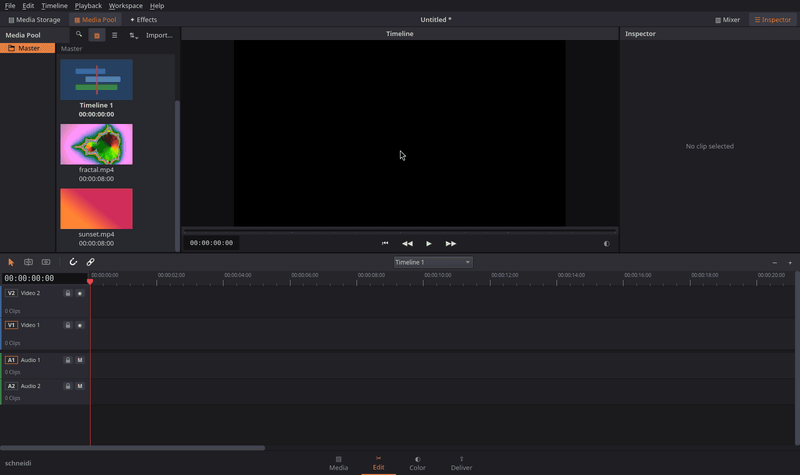
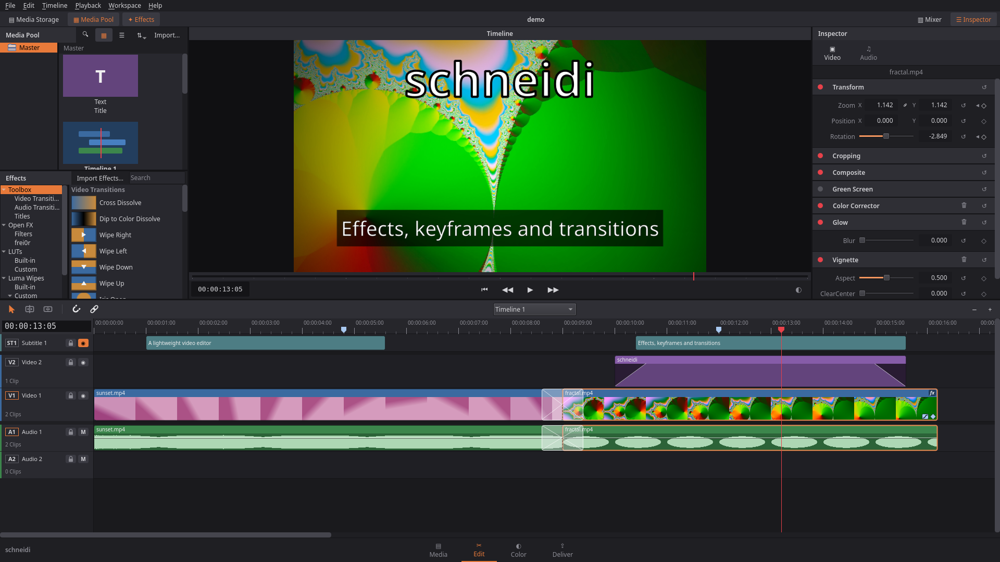
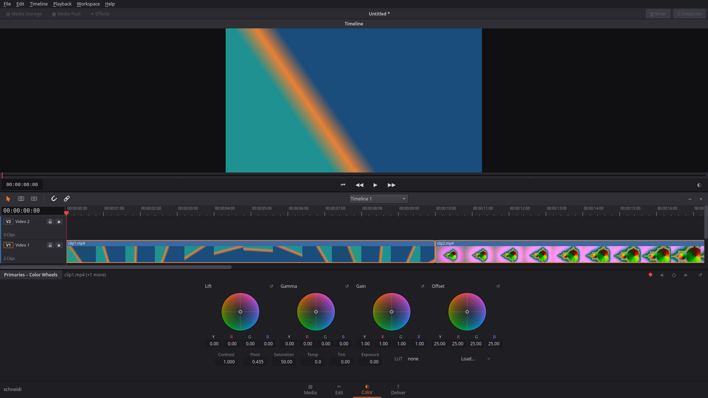

# schneidi

A lightweight video editor with Media, Edit, Color and Deliver pages. Its workflow is inspired by DaVinci Resolve, with far fewer features. The UI is available in English, German, Spanish, French, Polish and Russian.

A DaVinci-style workflow without DaVinci's hurdles: runs on modest hardware and opens H.264/H.265/AAC footage on Linux.

[](https://github.com/OnkelTheorie/schneidi/releases/latest)

**[Download the latest release](https://github.com/OnkelTheorie/schneidi/releases/latest)** (Linux AppImage or Debian package). To build from source, see [Building](#building).

> Status: early development (0.x). The project file format may still change between versions.





## Features

- Multiple video and audio tracks: cut, trim, move, snapping, undo/redo
- Timeline zoom and scroll change **only on user input** – nothing jumps when clips get shorter
- Fully customizable keyboard shortcuts
- Titles, subtitles, fades, transitions, volume, loudness normalization
- Color correction, curves, LUTs, effects with keyframes
- frei0r effects; import effect presets from Kdenlive and Shotcut
- Video scopes: waveform, RGB parade, vectorscope, histogram
- Two-up/four-up trim view while dragging an edit
- Loudness and true-peak meters
- Clip speed / retime
- Proxy and render cache for smooth playback
- Export and render queue via FFmpeg
- Subtitles from speech (whisper.cpp, offline) – pick the voice tracks, one subtitle track each; an optional download under Workspace → Extensions
- **Command line and MCP server** (`schneidi-cli`): scripts or an AI assistant can edit almost everything the app can – find pauses and scene changes, transcribe, cut and trim, grade, animate, mix and normalize, measure loudness, look at frames and scopes, render ([details](#command-line-and-ai-editing-mcp))
- Themes, six UI languages (English, German, Spanish, French, Polish, Russian)

<details>
<summary>Color page</summary>



</details>

## Command line and AI editing (MCP)

`schneidi-cli` edits the same project files without a window, for scripts and AI assistants. A typical rough cut:
let the AI find the pauses, keep the rest, look at the result, render, then fine-tune in schneidi.

```bash
schneidi-cli new talk.schneidi --fps 25 --media talk.mp4
schneidi-cli silence talk.mp4 --project talk.schneidi        # "sound" ranges without the pauses
schneidi-cli scenes broll.mp4 --project talk.schneidi        # shot changes
schneidi-cli extensions --install whisper,small              # optional speech recognition (download, ~200 MB)
schneidi-cli transcribe talk.mp4 --language de --words       # what is said, with word times
schneidi-cli edit talk.schneidi --ops '[{"op":"keep","media":"talk.mp4","ranges":[[0,250],[310,900]]}]'
schneidi-cli frames talk.schneidi --count 9 --sheet --out sheet.jpg
schneidi-cli scopes talk.schneidi --at 10s --out scopes.png      # waveform, parade, vectorscope + numbers
schneidi-cli loudness talk.schneidi                          # LUFS, true peak of the mix
schneidi-cli render talk.schneidi --out talk-cut.mp4 --preset "YouTube 1080p"
schneidi-cli restore talk.schneidi                           # undo the last change
schneidi-cli help                                            # all commands (JSON)
schneidi-cli help edit                                       # every edit operation with details
```

Edit operations cover cutting, inserting and source edits (insert, replace, place on top, fit to fill), moving,
trimming (ripple, roll, slip, slide), titles with their style, fades, transitions (dissolve, dip, wipes, luma),
speed and speed ramps, markers, subtitles (SRT or cue lists, track styles), effects and presets, the color grade
(wheels, LUTs), transform and crop, keyframes for any animatable value, paste attributes, volume/pan, the mixer,
loudness normalization, tracks, linking, compound clips, several timelines and the project format. Output is JSON on stdout (exit code 0 = ok,
1 = error, 2 = usage error); every save keeps a backup of the previous state (`backups`, `restore`). `schneidi-cli mcp` runs the same commands as an [MCP](https://modelcontextprotocol.io) server on stdio, e.g. for
Claude Code: `claude mcp add schneidi -- schneidi-cli mcp`, or in Claude Desktop's `claude_desktop_config.json`:

```json
{ "mcpServers": { "schneidi": { "command": "/path/to/schneidi-cli", "args": ["mcp"] } } }
```

The project can stay open in schneidi: the app reloads it when the CLI saves (with unsaved changes it asks first).
The AppImage contains the CLI too: `schneidi-x86_64.AppImage cli help`, or a link to the AppImage named `schneidi-cli`.

## Building

C++20, Qt 6 Widgets, MLT 7, CMake.

**Linux (Debian/Ubuntu):**

```bash
sudo apt install build-essential cmake ninja-build pkg-config qt6-base-dev libmlt++-dev libmlt-dev
cmake -S . -B build -G Ninja && cmake --build build && ./build/schneidi
```

AppImage: `packaging/linux/build-appimage.sh` → `dist/schneidi-<version>-x86_64.AppImage`
Debian package (system Qt/MLT, no bundling): `cmake --build build && cpack --config build/CPackConfig.cmake -G DEB` → `dist/schneidi_<version>_amd64.deb`

**Windows:** via [MSYS2](https://www.msys2.org), UCRT64 environment. Clone the repo into a path without spaces or non-ASCII characters, then:

```bash
pacman -S --needed mingw-w64-ucrt-x86_64-{toolchain,cmake,ninja,pkgconf,qt6-base,qt6-svg,mlt,ffmpeg,frei0r-plugins,SDL2,ntldd,libebur128,fftw,libsamplerate,rubberband,rtaudio}
packaging/windows/build-windows.sh
```

Result: `dist/schneidi-windows-<version>.zip` (portable folder) and, if [Inno Setup 6](https://jrsoftware.org/isinfo.php) is installed (`winget install JRSoftware.InnoSetup`), `dist/schneidi-setup-<version>.exe`.

**Tests:**

```bash
cmake -S . -B build-tests -G Ninja -DSCHNEIDI_TESTS=ON && cmake --build build-tests && ctest --test-dir build-tests --output-on-failure
```

## Credits

Developed by [OnkelTheorie](https://github.com/OnkelTheorie) with the help of [Claude](https://claude.ai) (Anthropic) as an AI coding assistant.

## Disclaimer

schneidi is an independent open-source project. It is not affiliated with, endorsed by or sponsored by Blackmagic Design. DaVinci Resolve is a trademark of Blackmagic Design Pty Ltd and is mentioned here for descriptive purposes only.

## License

[GPL-3.0](LICENSE)
